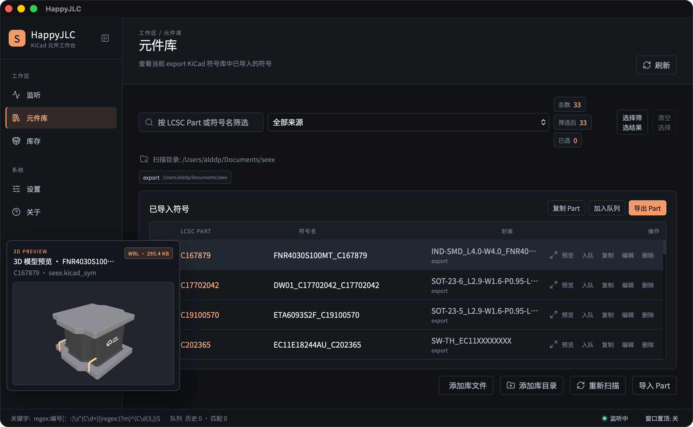
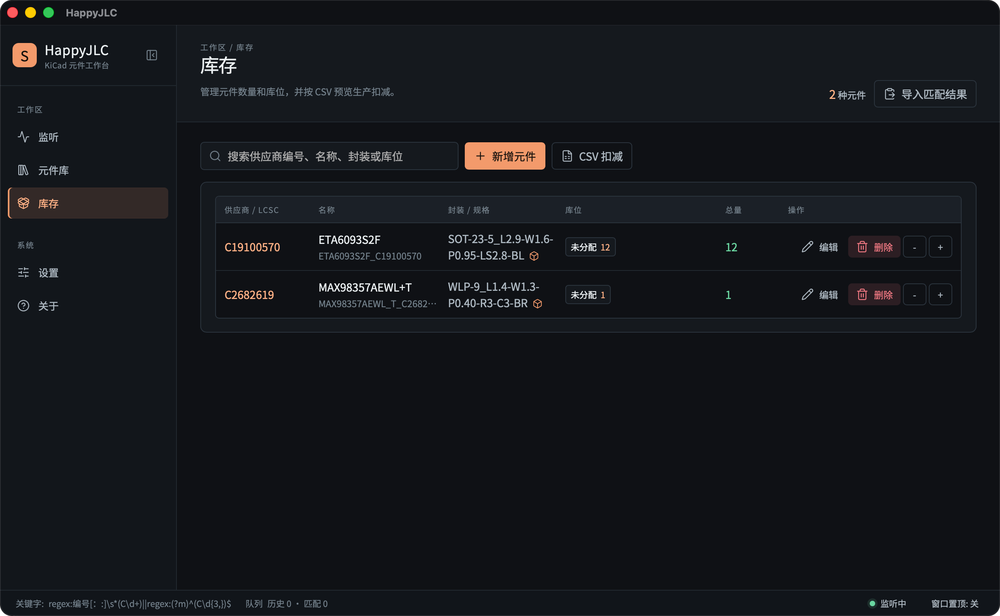
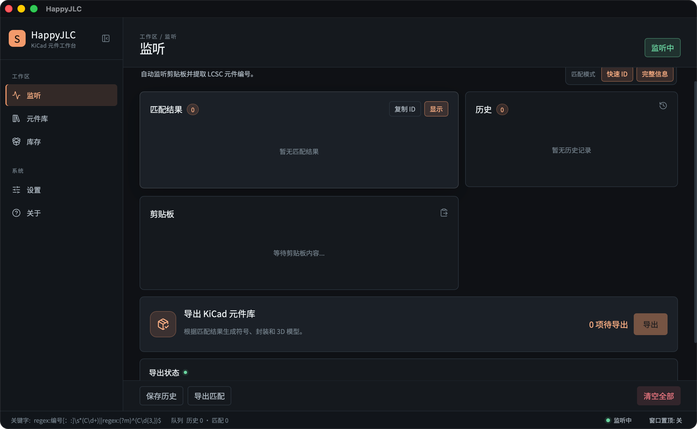
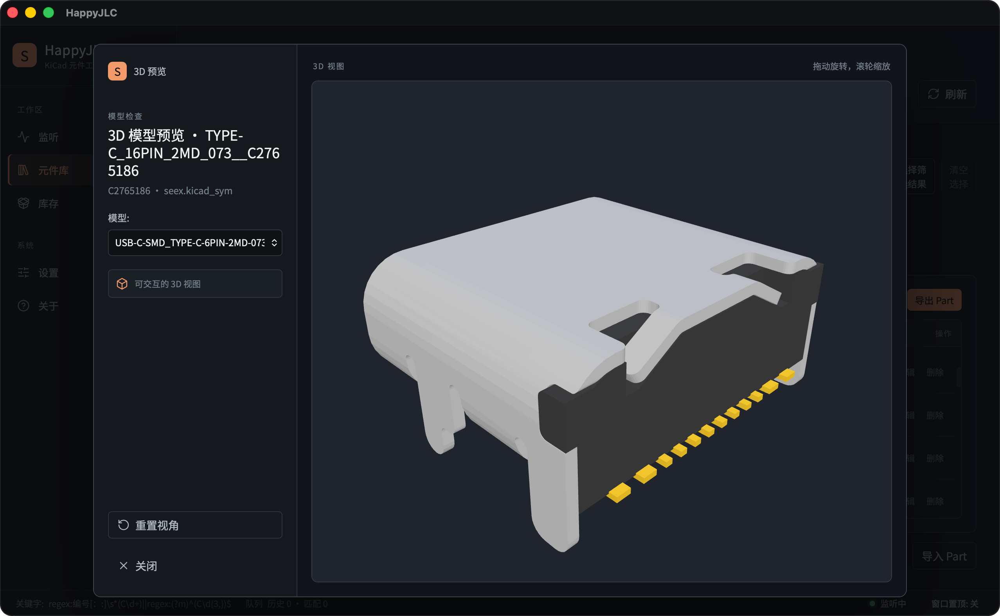

<div align="center">
  
  <h1>HappyJLC</h1>
  <p><strong>从一个元件编号，到一套可用的 KiCad 库。</strong></p>
  <p>一个面向真实硬件工作流的元件转换、管理与库存工具。</p>
  <br />
  <a href="https://github.com/Alddp/happyjlc/releases"></a>
  <a href="LICENSE"></a>
  <br />
  <sub>macOS 桌面端为主 · Windows 桌面端与多平台 CLI 经 CI 构建</sub>
</div>

## 目录

- [HappyJLC 是什么](#happyjlc-是什么)
- [你可以用它做什么](#你可以用它做什么)
- [界面一览](#界面一览)
- [快速开始](#快速开始)
- [常见问题](#常见问题)
- [文档](#文档)
- [致谢与相关项目](#致谢与相关项目)
- [参与项目](#参与项目)
- [许可证](#许可证)

## HappyJLC 是什么

在 KiCad 工作流里，一个元件往往要经历：找到 LCSC 编号、下载数据、生成符号和封装、确认 3D 模型、整理库文件，最后还要知道库存在哪里。

HappyJLC 把这条链路放进一个清晰的工作台：复制元件信息即可开始，导出后可以立即检查，确认可用后继续进入库存和 BOM 流程。

它适合希望减少重复操作、保持元件库整洁，并让“设计数据”和“实际物料”保持联系的人。

## 你可以用它做什么

### 监听与收集

监听剪贴板中的 LCSC 元件编号，支持关键词、正则和多模式匹配；自动去重，保留历史记录，并形成待处理队列。

### 转换与导出

生成 KiCad 符号、封装和 3D 模型。可以只导出需要的资产，也可以一次完成完整导出；已有文件是否覆盖可以分别控制。

### 检查与整理

扫描已经导入的符号库和封装库，查看来源、封装和 LCSC Part，编辑元件信息，删除不再需要的生成资产，并直接预览 3D 模型。

### 库存与 BOM

维护元件数量和库位，导入 BOM，先预览匹配结果，再按生产记录确认扣减库存。

## 界面一览

<table>
  <tr>
    <td align="center" width="50%">
      <a href="docs/screenshots/happyjlc-library.png">
        
      </a>
      <br /><sub>元件库与快速 3D 预览</sub>
    </td>
    <td align="center" width="50%">
      <a href="docs/screenshots/happyjlc-inventory.png">
        
      </a>
      <br /><sub>库存与 BOM 管理</sub>
    </td>
  </tr>
  <tr>
    <td align="center" width="50%">
      <a href="docs/screenshots/happyjlc-monitor.png">
        
      </a>
      <br /><sub>剪贴板监听与导出工作台</sub>
    </td>
    <td align="center" width="50%">
      <a href="docs/screenshots/happyjlc-3d-preview.png">
        
      </a>
      <br /><sub>交互式 3D 模型预览</sub>
    </td>
  </tr>
</table>

## 快速开始

### 下载

前往 [Releases](https://github.com/Alddp/happyjlc/releases) 查看可用版本和构建产物。

### 仓库结构

HappyJLC 是一个 Cargo workspace monorepo：

- `crates/core/`：EasyEDA/LCSC → KiCad 共享转换核心。
- `crates/cli/`：`happyjlc` CLI 入口，供服务器/脚本场景使用。
- `apps/desktop/`：Tauri 桌面应用，直接调用 `happyjlc-core`，无需外部 CLI。

### 从源码运行

需要 Rust stable、Node.js 20+、npm 和 [just](https://github.com/casey/just)。

```bash
npm --prefix apps/desktop ci
just tauri-dev
```

只想查看前端界面时：

```bash
just frontend-dev
```

一键跑完整检查（格式、编译、测试、clippy、前端构建）：

```bash
just verify
```

### 命令行转换

CLI 适合自动化和服务器场景；桌面端不依赖它，直接调用核心库：

```bash
cargo run -p happyjlc-cli -- \
  --lcsc-id C2040 \
  --full \
  --output ./library
```

更完整的使用方式、参数和配置说明见 [使用指南](docs/usage.md)。

## 常见问题

<details>
  <summary><strong>HappyJLC 适合谁？</strong></summary>
  <br />
  适合使用 KiCad、经常从 LCSC/EasyEDA 查找元件，并希望减少手工整理库文件和库存记录的人。它也适合需要批量处理元件的个人开发者和小型硬件团队。
</details>

<details>
  <summary><strong>它会替代 KiCad 吗？</strong></summary>
  <br />
  不会。HappyJLC 专注于 KiCad 之前和之后的元件工作流：准备元件库、确认模型、管理来源与库存；原理图和 PCB 设计仍然在 KiCad 中完成。
</details>

<details>
  <summary><strong>它和 SeEx、npnp 是什么关系？</strong></summary>
  <br />
  HappyJLC 与它们有共同的项目来源和 EDA 工作流背景，但当前作为独立项目维护，不依赖 SeEx 的二进制，也不把 npnp 作为本仓库的直接依赖。详情见下方的相关项目说明。
</details>

<details>
  <summary><strong>需要联网吗？数据从哪来？</strong></summary>
  <br />
  转换和导出需要联网从 LCSC/EasyEDA 拉取元件数据；离线时可继续使用已导入的元件库、库存和 BOM 功能。测试不访问真实服务，使用 fixture 或 mock HTTP server。
</details>

<details>
  <summary><strong>会修改我的 KiCad 库吗？</strong></summary>
  <br />
  只在导出时写入你指定的输出目录。符号、封装和 3D 模型可分别控制是否覆盖已有文件，默认不覆盖。
</details>

## 文档

- [使用指南](docs/usage.md)：安装、桌面端、CLI、导出和配置。
- [开发指南](docs/development.md)：项目结构、转换流程、测试、CI 和 release。
- [桌面应用说明](apps/desktop/README.md)：桌面端功能与本地开发。
- [转换核心说明](crates/core/README.md)：共享转换核心与测试。

## 致谢与相关项目

感谢 [Ref42](https://github.com/ref42) 对相关 EDA 工具和工作流的持续维护。HappyJLC 的项目方向、功能设计和历史来源与以下项目有关：[SeEx](https://github.com/ref42/seex)（面向剪贴板 LCSC 编号追踪、BOM CSV 导出和 EDA 元件库导出的桌面工具，以二进制版本发布）和 [npnp](https://github.com/ref42/npnp)（纯 Rust 元件库导出工具，支持 EasyEDA/LCSC 数据及 KiCad、Altium 库输出）。HappyJLC 作为独立 monorepo 维护，不依赖 SeEx 二进制，也不把 npnp 作为 workspace crate。使用相关项目时请遵守各自许可证。

## 参与项目

欢迎通过 [Issues](https://github.com/Alddp/happyjlc/issues) 提交问题、使用反馈和功能建议；PR 也很欢迎，改动前建议先在 Issue 里说明方向。提交 Issue 时附上操作系统、复现步骤和相关日志，更容易定位问题。开发约定见仓库根目录 `AGENTS.md` 与各子包的 `AGENTS.md`，本地验证可用 `just verify`。

## 许可证

HappyJLC 使用 CC BY-NC 4.0，详见 [`LICENSE`](LICENSE)。
